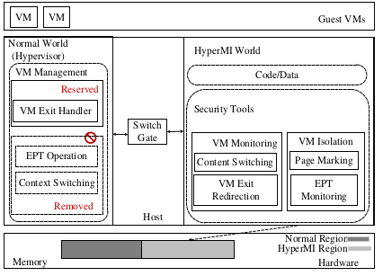
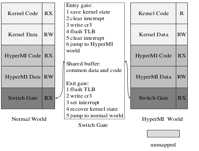

# HyperMI:  A Privilege-level Secure Execution Environment #

# Table of Contents #

* [Introduction](#introduction)    
    * [The modified Host OS kernel](#the-modified-host-os-kernel)
    * [The HyperMI World](#the-hypermi-world)
    * [The Switch Gate](#the-switch-gate)
* [Compilation and Installation](#compilation-and-installation)

# Introduction # 
**HyperMI** is a *secure* and *in-kernel isolated* execution environment to protect Virtual Machines (VMs) against the compromised hypervisor. Currently, we designed and implemented **HyperMI** on the KVM-based cloud computing environment.   

**HyperMI**, as shown in Figure 1, consists of three parts: the modified host OS kernel (not trusted), the HyperMI World and the Swith Gate.     

## The Modified Host OS Kernel ##
Since the hypervisor/Host OS is not trusted by us, access to some critical data structures must be restrictd. The following modifications were made to the Host OS Kernel by **HyperMI**
1. Virtual Machines Control Structure (VMCS) and Extended Page Table (EPT) are removed from the original kernel. 
2. Funtions which are relavant to Control Registers (CR0, CR3, CR4), VMCS, EPT, DMA are hooked. 

## The HyperMI World ##
The HyperMI World is the *secure* and *in-kernel isolated* execution environment to host important data structures and security tools. **HyperMI** has full capability of monitoring the Hypervisor and protecting critical data structures. Currently, the HyperMI world hosts the following data structures and security tools: 
1. Important Data Structures: 
    * Virtual Machines Control Structure (VMCS)
    * Extended Page Table (EPT)
2. Security Tools: 
    * Verification Program for Control Registers and DMA Mapping 
    * Physical Page Tag Table (PPTT)    
    
Verification Program for Control Registers and DMA Mapping is used to prevent the compromised hypervisor/Host OS kernel from subverting our HyperMI World.    
EPT behaviors are controlled by the three control bits in PPTT: PFN(Physical Page Frame Number), OwnerID and Shared ID. With the help of PPTT, the way to subvert the isolation of different VMs through dedicated EPT entries is hindered. 

## The Switch Gate ##
The Switch Gate is the only interface between the Normal World (the compromised hypervisor/Host OS Kernel) and the HyperMI world. Figure 2 shows the detail of this Switch Gate.    
   

The Switch Gate may be samilar with the Switch Gate proposed by [SKEE](https://wenboshen.org/assets/papers/skee-ndss16.pdf) at the first look. But, there are several differents between them: 
1. **HyperMI** implemented the Switch Gate in x86\_64 environment, while SKEE just implemented their work based on ARM v7 and ARM v8. 
2. **HyperMI** implemented the Swith Gate by using a new kernel page table hosted in the HyperMI world, the access to the original kernel page table are restrictd. This approach is totally different from the approach adopted by SKEE. 

# Compilation and Installation #

